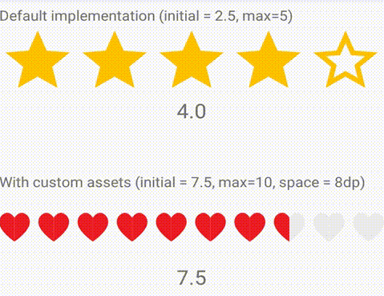

# Drag Rating

Drag rating is a rating view inspired of Drag Review from Book My Show app. The purpose of this library is to create simple and easy to use Drag Rating Widget with support for custom assets.



Include this library by adding below line to the module level `build.gradle`
```Gradle
dependencies {
    implementation 'com.github.saran2020:DragRating:2.0'
}
```

**layout.xml**
```xml
<com.github.saran2020.dragrating.DragRatingView
    android:id="@+id/slide_rating"
    android:layout_width="match_parent"
    android:layout_height="wrap_content"
    app:initial_rating="2.5"
    app:rating_space="8dp"
    app:max_rating="5" />
```
`initial_rating` - It's used to set the initial rating to the widget.  
`max_rating` - It's used to set the maximum allowed rating. The number you provide here is the number of stars that will be drawn.  
`rating_space` - It can be used to control the space between two star views.

Current rating can be read using `getRating()` and to set the rating use method `setRating(3.5f)`.


To provide custom asset for the view, you need to set a `Map` with the multiplier for the asset and the asset like shown below.

Passing custom asset resource id
```kotlin
ratingView.setDrawableResourceAssetMap(
    mapOf(
        0f to R.drawable.ic_star_empty,
        0.5f to R.drawable.ic_star_half,
        1f to R.drawable.ic_star_full
    )
)
```

Passing asset as `Drawable` in kotlin
```kotlin
ratingView.setDrawableAssetMap(
    mapOf(
        0f to emptyRating,
        0.5f to halfRating,
        1f to fullRating
    )
)
```
**NOTE: You should only provide the multiplier between 0 and 1. If the current rating is 1.5 it will automatically fill one star with the asset mapped to `1f` and one star with asset mapped to `0.5f`**

Callback when user is dragging the `DragRatingView`
```kotlin
ratingView.callback = object : DragRatingView.RatingChangeCallback {
    override fun onRatingChange(previous: Float, new: Float) {
        Log.d(TAG, "previous rating = $previous new rating = $current")
    }
}
```
